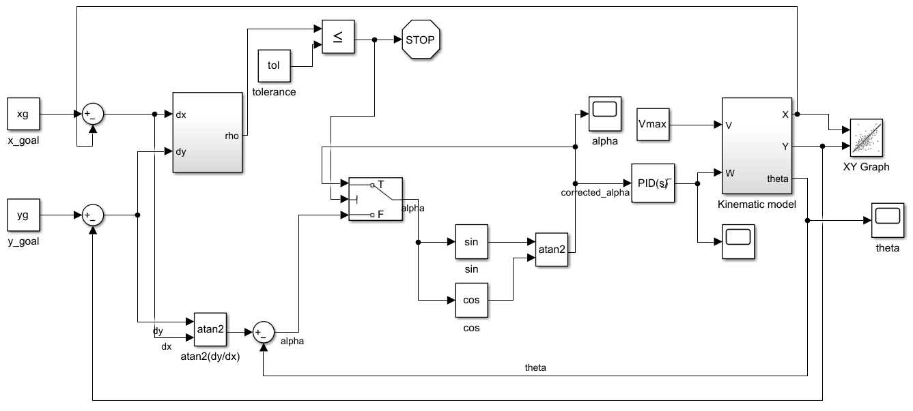
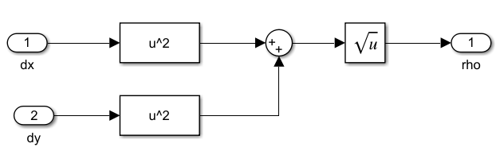
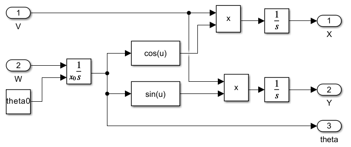

# Differential-Drive-Mobile-Robot-Control-PID-Study

Differential-drive mobile robot control using P, PI, and PID controllers. MATLAB simulation of robot motion from start to goal with trajectory visualization and performance comparison.

---

## 📌 Project Overview

This project investigates the control of a differential-drive mobile robot using kinematic modeling and feedback control techniques.

The robot is required to move from an initial position to a desired goal position, while adjusting its heading appropriately.

The main goal is to design, implement, and compare different controllers—Proportional (P), Proportional-Integral (PI), Proportional-Derivative (PD) and Proportional-Integral-Derivative (PID)—for heading control.

Different tuning methods (manual tuning, Ziegler–Nichols, and MATLAB PID Tuner) are applied and compared to obtain the best controller performance.

The controllers are evaluated based on trajectory smoothness and the robot’s ability to reach the desired goal position.

The system is developed and simulated in MATLAB, with visualizations of robot motion and path tracking.

---

## 🎯 Objectives

- Use a kinematic model of a differential-drive robot to compute control inputs  
- Compute heading error from the position (x, y) to a desired goal  
- Design and implement heading controllers (P, PI, PD, PID) to generate angular velocity (ω)
- Apply and compare different tuning methods (Manual, Ziegler–Nichols, and MATLAB PID Tuner)  
- Compare controller performance based on trajectory smoothness and goal reaching  
- Visualize robot motion and trajectory behavior  

---

## ✨ Features

- Simulation of a differential-drive mobile robot in MATLAB  
- Implementation of P, PI, PD and PID controllers
- Application and comparison of different tuning methods (manual, Ziegler–Nichols, MATLAB PID Tuner)  
- Trajectory generation from start to goal position  
- Visualization of robot motion and path  
- Comparison of controller performance  

---

## ⚙️ Mobile Robot Model

A differential-drive mobile robot is used in this project. It consists of two independently driven wheels separated by a fixed distance, allowing the robot to move by controlling the wheel velocities.

The robot motion is described using three state variables: position (x, y) and orientation (θ), and two control inputs: linear velocity (v) and angular velocity (ω). This makes the system multivariable.

The kinematic model of the robot is nonlinear, since the position states depend on the orientation through trigonometric relationships:

$$
\dot{x} = v  \cos(\theta)
$$

$$
\dot{y} = v  \sin(\theta)
$$

$$
\dot{\theta} = \omega
$$

Because of this nonlinearity, directly controlling (x, y, θ) is not straightforward using simple feedback control.

To simplify the problem, the linear velocity is kept constant, and the control effort is focused on regulating the robot heading. The position then evolves naturally based on the heading direction.

Additionally, the linear velocity is reduced when the robot approaches close distance to the goal to avoid oscillations and improve convergence.

---

## 🎮 Controller Design

### Error Definition

To guide the robot toward the goal position (x_goal, y_goal), the following errors are defined:

$$
\Delta x = x_{goal} - x
$$

$$
\Delta y = y_{goal} - y
$$

From these, two important quantities are computed:

$$
\rho = \sqrt{\Delta x^2 + \Delta y^2}
$$

$$
\alpha = \arctan2(\Delta y, \Delta x) - \theta
$$

Here, ρ represents how far the robot is from the goal, while α represents the angular deviation from the desired direction.

---

### Control Law

The control objective is to reduce the heading error α to zero. This is achieved using a PID controller:

$$
u(t) = K_p e(t) + K_i \int e(\tau)\, d\tau + K_d \frac{de}{dt}
$$

where the error \( e(t) = \alpha \).

The controller output defines the angular velocity:

$$
\omega = PID(\alpha)
$$

---

### Actuator Constraints and Wheel Velocity Computation

The computed angular velocity is limited to ensure that the control input remains within the achievable bounds of the actuators:

$$
\omega \in [-\omega_{max}, \omega_{max}]
$$

After applying saturation, the control inputs must be translated into actuator commands. Since the robot is driven by two wheels, the linear and angular velocities (v, ω) are converted into individual wheel angular velocities.

Using the inverse kinematics of the differential-drive robot:

$$
\omega_r = \frac{2v + \omega b}{2r}
$$

$$
\omega_l = \frac{2v - \omega b}{2r}
$$

where:

- r is the wheel radius  
- b is the distance between the two wheels  

These equations map the desired motion of the robot into motor commands for the right and left wheels.

The resulting wheel velocities are then applied to the robot, generating motion toward the goal position.

---

## 🧠 Controller Motivation and Parameter Effects

The heading error α plays a key role in the robot’s trajectory behavior:

- If α → 0, the robot aligns with the goal direction  
- If α remains large, the robot may overshoot or deviate from the desired path  

This motivates the use of feedback controllers to regulate the heading and ensure convergence toward the goal.

Different controller structures offer different performance characteristics:

- **P controller:** simple and responsive, but may result in steady-state error  
- **PI controller:** eliminates steady-state error, but may introduce slower response and overshoot  
- **PD controller:** improves responsiveness and reduces oscillations, but is sensitive to noise  
- **PID controller:** combines the advantages of all three for balanced performance  

The influence of PID parameters on system behavior is well established in control theory. In general:

- \( K_p \) increases responsiveness and reduces rise time, but may lead to overshoot  
- \( K_i \) eliminates steady-state error, but can slow the response and increase overshoot  
- \( K_d \) improves damping, reduces oscillations, and enhances stability  

These relationships provide practical guidelines for tuning controller parameters.

A comparison table is typically used to relate these parameters to performance metrics such as rise time, overshoot, settling time, and steady-state error.
| Parameter Increase| Rise Time     | Overshoot     | Settling Time  | Steady-State Error |
|-------------------|---------------|---------------|----------------|--------------------|
| Kp                | Decrease      | Increase      | Small change   | Decrease           |
| Ki                | Small change  | Increase      | Increase       | Greatly reduced    |
| Kd                | Small change  | Decrease      | Small change   | Small change       |

---

## 🧩 Simulink Implementation

The complete control system is implemented in Simulink, integrating the kinematic model, error computation, and feedback controller into a closed-loop system.

The diagram below shows the overall structure of the control system, including:
- computation of the heading error  
- the PID controller  
- conversion to wheel velocities  
  

   
  <b>Figure 1.</b> Control system block diagram

<table align="center" style="table-layout: fixed;">
  <tr>
    <td align="center" width="50%">
       
    </td>
    <td align="center" width="50%">
       
    </td>
  </tr>

  <tr>
    <td align="center" valign="top">
      <b>Figure 2.</b> Distance calculator subsystem
    </td>
    <td align="center" valign="top">
      <b>Figure 3.</b> Kinematic model subsystem
    </td>
  </tr>
</table>

This implementation reflects the full control pipeline, from position error computation to actuator commands, enabling simulation of the robot motion toward the desired goal.

---
