# Differential-Drive-Mobile-Robot-Control-PID-Study

Differential-drive mobile robot control using P, PI, and PID controllers. MATLAB simulation of robot motion from start to goal with trajectory visualization and performance comparison.

---

## 📌 Project Overview

This project investigates the control of a differential-drive mobile robot using kinematic modeling and feedback control techniques.

The robot is required to move from an initial position to a desired goal position, while adjusting its heading appropriately.

The main goal is to design, implement, and compare different controllers—Proportional (P), Proportional-Integral (PI), Proportional-Derivative (PD) and Proportional-Integral-Derivative (PID)—for heading control.

Different tuning methods (manual tuning, Ziegler–Nichols, and MATLAB PID Tuner) are applied and compared to obtain the best controller performance.

The controllers are evaluated based on trajectory smoothness and the robot’s ability to reach the desired goal position.

The system is developed and simulated in MATLAB, with visualizations of robot motion and path tracking.

---

## 🎯 Objectives

- Use a kinematic model of a differential-drive robot to compute control inputs  
- Compute heading error from the position (x, y) to a desired goal  
- Design and implement heading controllers (P, PI, PD, PID) to generate angular velocity (ω)
- Apply and compare different tuning methods (Manual, Ziegler–Nichols, and MATLAB PID Tuner)  
- Compare controller performance based on trajectory smoothness and goal reaching  
- Visualize robot motion and trajectory behavior  

---

## ✨ Features

- Simulation of a differential-drive mobile robot in MATLAB  
- Implementation of P, PI, PD and PID controllers
- Application and comparison of different tuning methods (manual, Ziegler–Nichols, MATLAB PID Tuner)  
- Trajectory generation from start to goal position  
- Visualization of robot motion and path  
- Comparison of controller performance  

---

## ⚙️ Mobile Robot Model

A differential-drive mobile robot is used in this project. It consists of two independently driven wheels separated by a fixed distance, allowing the robot to move by controlling the wheel velocities.

The robot motion is described using three state variables: position (x, y) and orientation (θ), and two control inputs: linear velocity (v) and angular velocity (ω). This makes the system multivariable.

The kinematic model of the robot is nonlinear, since the position states depend on the orientation through trigonometric relationships:

$$
\dot{x} = v  \cos(\theta)
$$

$$
\dot{y} = v  \sin(\theta)
$$

$$
\dot{\theta} = \omega
$$

Because of this nonlinearity, directly controlling (x, y, θ) is not straightforward using simple feedback control.

To simplify the problem, the linear velocity is kept constant, and the control effort is focused on regulating the robot heading. The position then evolves naturally based on the heading direction.

Additionally, the linear velocity is reduced when the robot approaches close distance to the goal to avoid oscillations and improve convergence.

---

## 🎮 Controller Design

### Error Definition

To guide the robot toward the goal position (x_goal, y_goal), the following errors are defined:

$$
\Delta x = x_{goal} - x
$$

$$
\Delta y = y_{goal} - y
$$

From these, two important quantities are computed:

$$
\rho = \sqrt{\Delta x^2 + \Delta y^2}
$$

$$
\alpha = \arctan2(\Delta y, \Delta x) - \theta
$$

Here, ρ represents how far the robot is from the goal, while α represents the angular deviation from the desired direction.

---

### Control Law

The control objective is to reduce the heading error α to zero. This is achieved using a PID controller:

$$
u(t) = K_p e(t) + K_i \int e(\tau)\, d\tau + K_d \frac{de}{dt}
$$

where the error $( e(t) = \alpha $).

The controller output defines the angular velocity:

$$
\omega = PID(\alpha)
$$

---

### Actuator Constraints and Wheel Velocity Computation

The computed angular velocity is limited to ensure that the control input remains within the achievable bounds of the actuators:

$$
\omega \in [-\omega_{max}, \omega_{max}]
$$

After applying saturation, the control inputs must be translated into actuator commands. Since the robot is driven by two wheels, the linear and angular velocities (v, ω) are converted into individual wheel angular velocities.

Using the inverse kinematics of the differential-drive robot:

$$
\omega_r = \frac{2v + \omega b}{2r}
$$

$$
\omega_l = \frac{2v - \omega b}{2r}
$$

where:

- r is the wheel radius  
- b is the distance between the two wheels  

These equations map the desired motion of the robot into motor commands for the right and left wheels.

The resulting wheel velocities are then applied to the robot, generating motion toward the goal position.

---

## 🧠 Controller Motivation and Parameter Effects

The heading error α plays a key role in the robot’s trajectory behavior:

- If α → 0, the robot aligns with the goal direction  
- If α remains large, the robot may overshoot or deviate from the desired path  

This motivates the use of feedback controllers to regulate the heading and ensure convergence toward the goal.

Different controller structures offer different performance characteristics:

- **P controller:** simple and responsive, but may result in steady-state error  
- **PI controller:** eliminates steady-state error, but may introduce slower response and overshoot  
- **PD controller:** improves responsiveness and reduces oscillations, but is sensitive to noise  
- **PID controller:** combines the advantages of all three for balanced performance  

The influence of PID parameters on system behavior is well established in control theory. In general:

- $( K_p $) increases responsiveness and reduces rise time, but may lead to overshoot  
- $( K_i $) eliminates steady-state error, but can slow the response and increase overshoot  
- $( K_d $) improves damping, reduces oscillations, and enhances stability  

These relationships provide practical guidelines for tuning controller parameters.

A comparison table is typically used to relate these parameters to performance metrics such as rise time, overshoot, settling time, and steady-state error.
| Parameter Increase| Rise Time     | Overshoot     | Settling Time  | Steady-State Error |
|-------------------|---------------|---------------|----------------|--------------------|
| Kp                | Decrease      | Increase      | Small change   | Decrease           |
| Ki                | Small change  | Increase      | Increase       | Greatly reduced    |
| Kd                | Small change  | Decrease      | Small change   | Small change       |

---

## 🧩 Simulink Implementation

The complete control system is implemented in Simulink, integrating the kinematic model, error computation, and feedback controller into a closed-loop system.

The diagram below shows the overall structure of the control system, including:
- computation of the heading error  
- the PID controller  
- conversion to wheel velocities  
  

   
  <b>Figure 1.</b> Control system block diagram

<table align="center" style="table-layout: fixed;">
  <tr>
    <td align="center" width="50%">
       
    </td>
    <td align="center" width="50%">
       
    </td>
  </tr>

  <tr>
    <td align="center" valign="top">
      <b>Figure 2.</b> Distance calculator subsystem
    </td>
    <td align="center" valign="top">
      <b>Figure 3.</b> Kinematic model subsystem
    </td>
  </tr>
</table>

This implementation reflects the full control pipeline, from position error computation to actuator commands, enabling simulation of the robot motion toward the desired goal.

---

## 🚗 Velocity Constraints and Analysis

### 📐 Theoretical Maximum Velocities

The maximum rotational speed of the motors can be converted from RPM to angular velocity (rad/s), giving the maximum wheel speeds.

Using the robot kinematics, the theoretical limits of motion can be derived:

- Maximum linear velocity occurs when both wheels rotate at maximum speed in the same direction  
- Maximum angular velocity occurs when the wheels rotate at maximum speed in opposite directions  

These values represent ideal upper bounds under perfect conditions.

### ⚙️ Practical Velocity Limits

The theoretical maximum velocities are derived under ideal assumptions and represent upper bounds of the robot’s capabilities. However, in practice, these values cannot be fully achieved due to factors such as system dynamics, actuator limitations, and external loads, which effectively reduce the attainable speeds.

For this project, the robot parameters are:

- Wheel radius: $( r = 0.05 \text{m} $)  
- Wheel separation: $( b = 0.2 \text{m} $)  

Based on these considerations, conservative and practical limits were selected:

$$
v_{\text{max}} = 0.8 \, \text{m/s}
$$

$$
\omega_{\text{max}} = 3 \, \text{rad/s}
$$

These limits ensure reliable operation by keeping the system within achievable performance bounds. They also help maintain smooth motion and allow the feedback controller to operate effectively without demanding unrealistically high actuator speeds.

---

## 📊 Effect of Velocity Limits

The effect of varying $( v_{\text{max}} $) and $( \omega_{\text{max}} $) on robot performance was analyzed through simulation.

Different values were tested, and the resulting trajectories were compared to evaluate:

- Smoothness of motion  
- Ability to reach the goal  
- Presence of oscillations  

The results are presented in the next section.

### 🔄 Effects of Varying $( v_{\text{max}} $) and $( \omega_{\text{max}} $)

   
  <b>Figure 4.</b> Trajectory comparison under different velocity constraints

The robot's behavior changes significantly when the maximum linear velocity $( v_{\text{max}} $) or maximum angular velocity $( \omega_{\text{max}} $) is adjusted, while keeping the PID gains fixed.

#### Effect of High $( v_{\text{max}} $)

Increasing $( v_{\text{max}} $) reduces the time needed to reach the goal because the robot moves faster along its path.

For example, increasing $( v_{\text{max}} $) from **0.80 m/s** to **1.50 m/s** (with $( \omega_{\text{max}} = 3.00 \, \text{rad/s} $)) reduced completion time from **8.90 s** to **4.75 s** as shown in Figure 4:

However, when the initial heading error is large, a higher $( v_{\text{max}} $) leads to wider turning arcs:
- The robot travels farther forward while correcting its heading  
- This causes outward drift during the initial turn  
- Results in larger loops before alignment with the goal  

**Trade-off:** faster completion vs. less efficient trajectory.

#### Effect of High $( \omega_{\text{max}} $)

Increasing $( \omega_{\text{max}} $) improves the robot's ability to change direction quickly.

- Faster alignment with the goal  
- More direct trajectory  
- Reduced overshoot and wasted motion  

In contrast, if $( \omega_{\text{max}} $) is too low relative to $( v_{\text{max}} $):

- The robot struggles to correct its heading  
- Wide arcs or sustained oscillations appear  

For example, reducing $( \omega_{\text{max}} $) from **3.00 rad/s** to **1.00 rad/s** (at $( v_{\text{max}} = 0.80 \, \text{m/s} $)) as shown in Figure 4:

- Introduced large oscillatory loops  
- Increased completion time from **9.85 s** to **14.30 s**  

---

## 📊 Controller Performance Evaluation

This section summarizes the performance of different manually-tuned controller configurations (P, PI, PD, PID) for heading control (α) in a differential drive robot under a kinematic model.

### 📈 Summary Table

| Config | Controller | Parameters | Time to Goal (s) | Overshoot (%) | Settling Time (s) | SSE (rad) | Path Behavior | Verdict |
|--------|-----------|------------|------------------|----------------|-------------------|------------|----------------|----------|
| 1 | P | Kp=0.5 | >30 (fail) | — | — | 1.5599 | Spiral | Unstable |
| 2 | P | Kp=1 | 10.05 | 0 | 4.4 | 0.0216 | Wide arc | Slow, residual error |
| 3 | P | Kp=11 | 9.45 | 0 | 0.85 | ~0 | Near-straight | Best overall |
| 4 | PI | Kp=11, Ki=10 | 9.65 | 33.66 | 4.1 | ~0 | S-curve | Overshoot introduced |
| 5 | PI | Kp=11, Ki=100 | 10.95 | 90.51 | 4.45 | ~0 | Loop | Windup dominant |
| 6 | PD | Kp=11, Kd=1 | 9.50 | 2.84 | 9.45 | 0.1798 | Near-straight | Chatter, high SSE |
| 7 | PID | Kp=11, Ki=100, Kd=1 | 10.70 | 90.51 | 10.65 | 0.0117 | Loop | Worse than PI |

---

### 📍 Trajectory Comparison

<table align="center" style="table-layout: fixed;">
  <tr>
    <td align="center" width="50%">
       
      Config 1
    </td>
    <td align="center" width="50%">
       
      Config 2
    </td>
  </tr>

  <tr>
    <td align="center">
       
      Config 3
    </td>
    <td align="center">
       
      Config 4
    </td>
  </tr>

  <tr>
    <td align="center">
       
      Config 5
    </td>
    <td align="center">
       
      Config 6
    </td>
  </tr>

  <tr>
    <td colspan="2" align="center">
       
      Config 7
    </td>
    <td></td>
  </tr>
</table>

  <b>Figure 5.</b> Robot trajectories for all controller configurations.

- Config 1 shows complete instability (spiral motion).  
- Configs 3 and 6 produce near-straight paths.  
- Configs 5 and 7 exhibit loops due to integral windup.

---

### 📉 Heading Error (α) Response
<table align="center" style="table-layout: fixed;">
  <tr>
    <td align="center" width="50%">
       
      Config 1
    </td>
    <td align="center" width="50%">
       
      Config 2
    </td>
  </tr>

  <tr>
    <td align="center">
       
      Config 3
    </td>
    <td align="center">
       
      Config 4
    </td>
  </tr>

  <tr>
    <td align="center">
       
      Config 5
    </td>
    <td align="center">
       
      Config 6
    </td>
  </tr>

  <tr>
    <td colspan="2" align="center">
       
      Config 7
    </td>
    <td></td>
  </tr>
</table>

  <b>Figure 6.</b> Heading error (α) over time for all configurations.

- P-only (Config 3) achieves the fastest clean convergence.  
- PI controllers eliminate steady-state error but introduce overshoot.  
- PD and PID configurations show persistent oscillations (chatter).

---

### 🔍 Detailed Observations

#### P Controllers
- Increasing Kp improves convergence speed and path efficiency.  
- Low gain (Kp=0.5) fails to correct heading.  
- High gain (Kp=11) is sufficient to drive error ≈ 0 without oscillations.  

#### PI Controllers
- Integral term eliminates steady-state error.  
- Higher Ki leads to integral windup, causing:  
  - Large overshoot  
  - Path distortion (loops)  
- Moderate Ki (Config 4) provides a trade-off but still degrades transient response.  

#### PD Controller
- Expected damping effect is not observed.  
- Derivative term introduces persistent small oscillations in α.  
- Results in the largest steady-state error among stable configurations.  

#### PID Controller
- Combines drawbacks of PI and PD:  
  - Windup from high Ki  
  - Oscillations from Kd  
- Does not outperform simpler configurations.  

---

### 🧠 Key Takeaways

- High proportional gain alone (Kp=11) provides the best performance in this kinematic system.  
- Integral control removes steady-state error but harms trajectory quality.  
- Derivative control amplifies discrete geometric updates, leading to oscillations rather than damping.  
- Classical PID tuning intuition does not directly apply to kinematic (non-dynamic) systems.  

### 📎 Notes

- All experiments were conducted under identical simulation conditions.  
- Constant forward velocity was maintained across all configurations.  
- Metrics computed from heading error (α) and trajectory tracking performance.  

---

## 🔧 Ziegler–Nichols PID Tuning Method

The Ziegler–Nichols (ZN) method is a classical heuristic approach used to obtain initial PID gains based on the dynamic response of a system. It is commonly applied using either open-loop or closed-loop procedures.

In this project, the open-loop (reaction curve) method is first considered.

### Open-Loop (Reaction Curve) Method

The open-loop Ziegler–Nichols method is based on approximating the system response using a first-order-plus-dead-time (FOPDT) model. The procedure typically involves:

- Applying a step input without feedback control  
- Recording the system output response  
- Extracting process parameters such as delay (L) and time constant (T)  
- Using standard ZN formulas to compute PID gains  

A graphical method is usually used to estimate L and T from the step response. Then, the Ziegler–Nichols table for open-loop response is used to calculate the PID gains.

  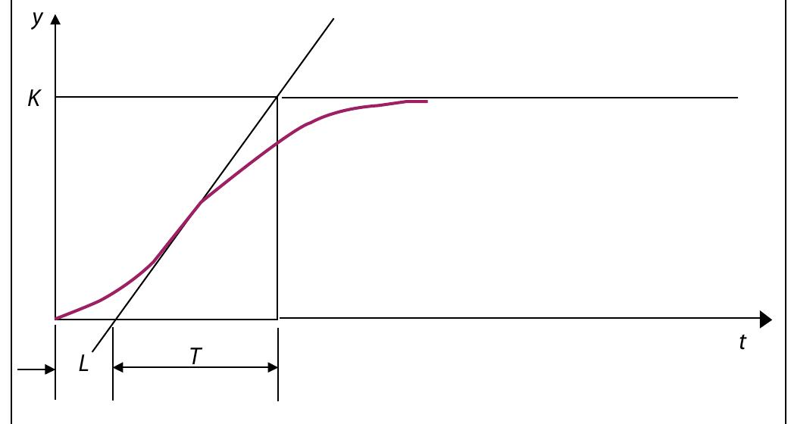 
  <b>Figure 7.</b> Zieglar Nichols open Loop method

#### Ziegler–Nichols Open-Loop Tuning Table

| Controller Type      | Kp             | Ti = 1/Ki         | Td = Kd   |
|-----------------     |-----------     |-----------        |---------  |
| P                    | T / L          | 0                 | 0         |
| PI                   | 0.9 T / L      | L / 0.3           | 0         |
| PID                  | 1.2 T / L      | 2L                | 0.5L      |

### The Plant in Our Robot

In this project, the plant refers to the robot dynamics being controlled:

- The controlled variable is the heading angle (θ), regulated through angular velocity (ω)  
- The linear velocity (v) is kept constant, resulting in a simplified SISO system  

A step input $( \omega_{cmd} $) is applied, and the resulting heading $( \theta(t) $) is observed with the PID controller bypassed.

A Simulink model is used to represent this open-loop configuration.

  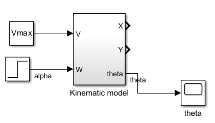 
  <b>Figure 8.</b> Zieglar Nichols open Loop Plant

### Open-Loop Response

The simulated response shows that $( \theta(t) $) increases linearly over time in response to the step input.

This behavior is consistent with a pure integrator system, where angular velocity directly integrates into orientation without additional dynamics.

  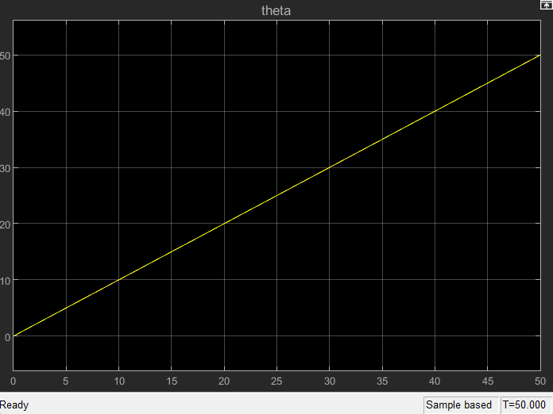 
  <b>Figure 9.</b> Ziegler Nichols open loop response

### Limitation of Open-Loop ZN Method

The open-loop Ziegler–Nichols method requires a system response with a clear transient shape to estimate delay (L) and time constant (T).

However, in this case:

- The response has no observable delay  
- The output behaves as a pure integrator (θ increases linearly)  
- No meaningful transient region exists for tangent-based estimation  

Therefore, the reaction curve method cannot be applied to this system, as the required model parameters (L and T) cannot be extracted reliably.

---

## 🔄 Ziegler–Nichols Closed-Loop (Ultimate Gain Method)

The closed-loop Ziegler–Nichols tuning method determines PID parameters experimentally by bringing the system to the stability limit under feedback control.

Unlike the open-loop method, this approach does not require an explicit model of the plant and instead relies on the closed-loop dynamics.

### Procedure

The tuning procedure is as follows:

- Set the controller to proportional-only control:  
  $( K_i = 0, \; K_d = 0 $)
- Gradually increase the proportional gain $( K_p $)
- Observe the system response until sustained oscillations with constant amplitude occur  

At this point, two parameters are recorded:

- $( K_u $): the ultimate gain that causes sustained oscillations  
- $( T_u $): the oscillation period  

This method relies on the feedback loop behavior and the system stability boundary.

### Simulink Implementation

To perform the test, the PID controller was replaced with a proportional gain block representing $( K_u $) in the closed-loop Simulink model.

A closed-loop diagram was used to observe the system response under increasing proportional gain.

  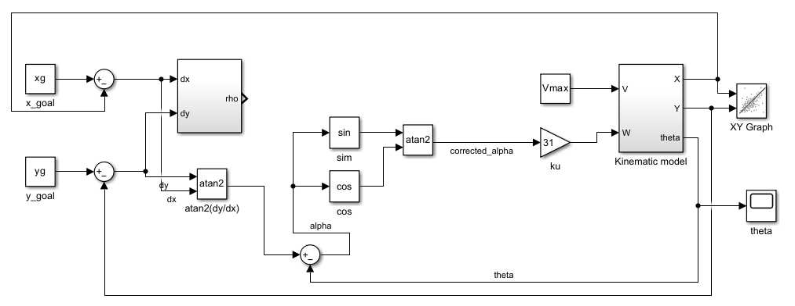 
  <b>Figure 10.</b> Ziegler Nichols closed loop block diagram

### Experimental Results

By increasing $( K_p $) applied to the heading error $( \alpha $), the system reached a sustained oscillatory state.

The following values were obtained:

- $( K_u = 31 $)  
- $( T_u = 0.5 \ \text{s} $)  

The resulting oscillatory response of $( \theta(t) $) is shown in the corresponding simulation plot.

  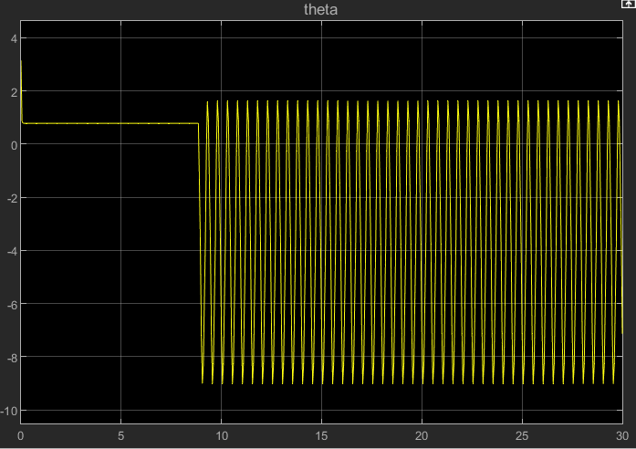 
  <b>Figure 11.</b> Ziegler Nichols closed loop response

### PID Gain Calculation

The obtained $( K_u $) and $( T_u $) values were substituted into the standard Ziegler–Nichols closed-loop tuning rules to compute the PID gains.

#### Ziegler–Nichols Closed-Loop Tuning Table

| Controller Type | Kp       | Ki              | Kd            |
|-----------------|----------|-----------------|---------------|
| P               | 0.5 Ku   | 0               | 0             |
| PI              | 0.45 Ku  | 0.45 Ku / Tu    | 0             |
| PID             | 0.6 Ku   | 1.2 Ku / Tu     | 3 Ku Tu / 40  |

#### Computed Controller Gains

| Control Type | Kp   | Ki    | Kd     |
|--------------|------|-------|--------|
| P            | 15.5 | 0     | 0      |
| PI           | 13.95| 33.48 | 0      |
| PID          | 18.6 | 74.4  | 1.1625 |

## 🔄 Controller Comparison

The resulting controllers (P, PI, and PID) were tested in simulation.

The following responses were analyzed:

- Heading error $( \alpha $) over time  
- Robot trajectory from start to goal position  

These results were used to evaluate the effectiveness of the Ziegler–Nichols tuning method in achieving stable and accurate goal-reaching behavior.

## 📊 Results and Discussion (Ziegler–Nichols Tuning)

The PID gains obtained using the Ziegler–Nichols closed-loop method were evaluated using P, PI, and PID controllers. Performance was assessed based on heading error $( \alpha $) in terms of overshoot, settling time, and steady-state error.

### P Controller Response

<table align="center" style="table-layout: fixed;">
  <tr>
    <td align="center" width="50%">
      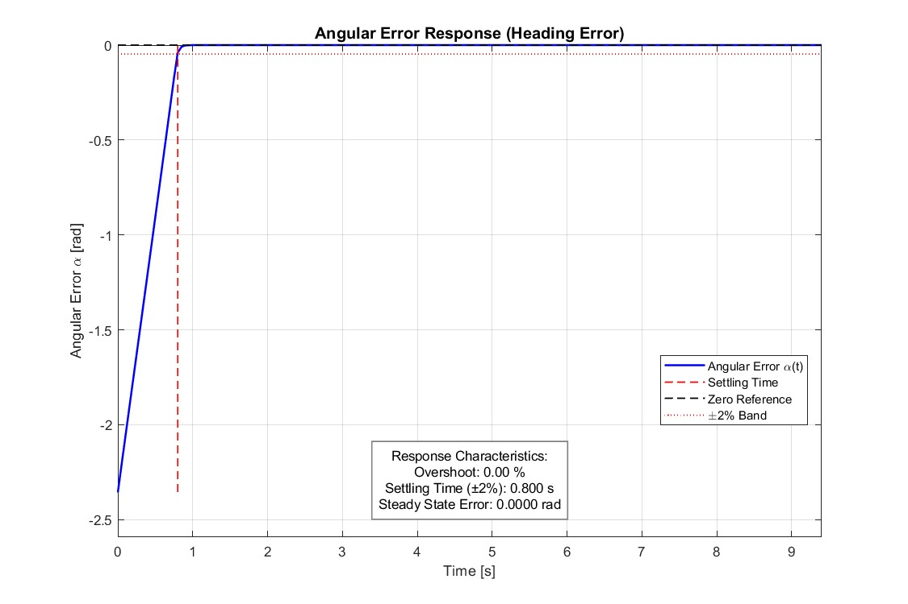 
    </td>
    <td align="center" width="50%">
      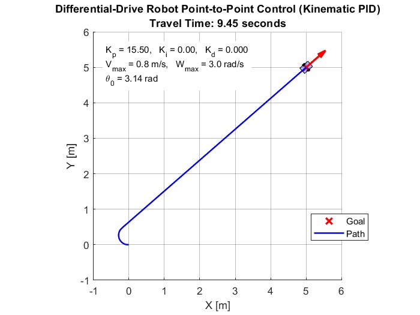 
    </td>
  </tr>

  <tr>
    <td align="center" valign="top">
      <b>Figure 12.</b> Response of P controller tuned by Ziegler Nichols method
    </td>
    <td align="center" valign="top">
      <b>Figure 13.</b> Robot trajectory of P controller tuned by Ziegler Nichols method
    </td>
  </tr>
</table>

- Overshoot: 0%  
- Settling time: 0.8 s  
- Steady-state error: 0  

The proportional controller provides a fast and stable response with no oscillations. The heading error converges quickly to zero, resulting in efficient trajectory tracking.

**Observation:** In this kinematic system, a properly tuned P controller is sufficient to achieve excellent performance without the need for additional control terms.

### PI Controller Response

<table align="center" style="table-layout: fixed;">
  <tr>
    <td align="center" width="50%">
      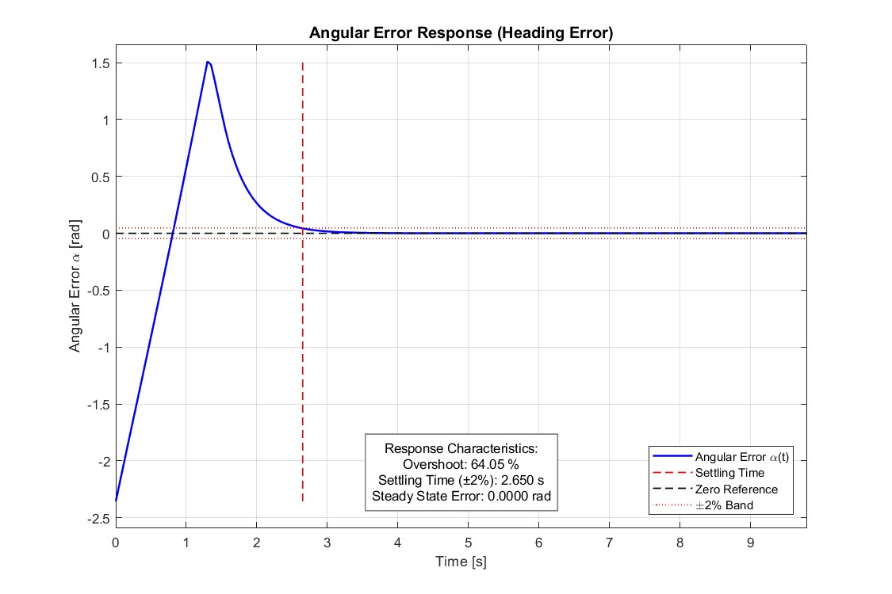 
    </td>
    <td align="center" width="50%">
      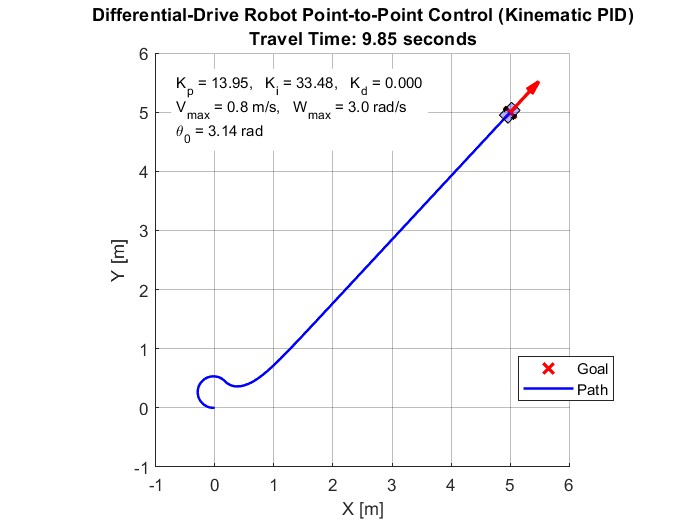 
    </td>
  </tr>

  <tr>
    <td align="center" valign="top">
      <b>Figure 14.</b> Response of PI controller tuned by Ziegler Nichols method
    </td>
    <td align="center" valign="top">
      <b>Figure 15.</b> Robot trajectory of PI controller tuned by Ziegler Nichols method
    </td>
  </tr>
</table>

- Overshoot: 64.05%  
- Settling time: 2.65 s  
- Steady-state error: 0  

The addition of the integral term eliminates steady-state error but introduces significant overshoot and oscillatory behavior. The response becomes slower compared to the P controller.

**Observation:** The integral action accumulates error over time, leading to aggressive corrections and degraded transient performance.

### PID Controller Response

<table align="center" style="table-layout: fixed;">
  <tr>
    <td align="center" width="50%">
      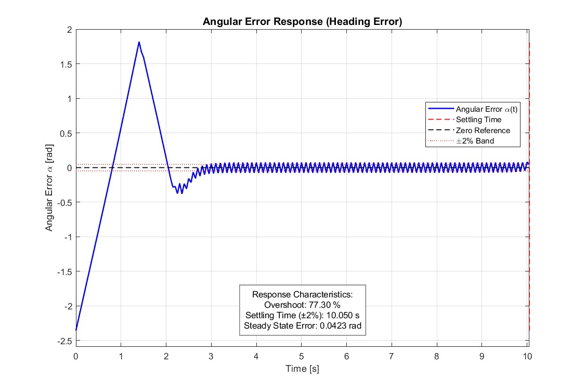 
    </td>
    <td align="center" width="50%">
      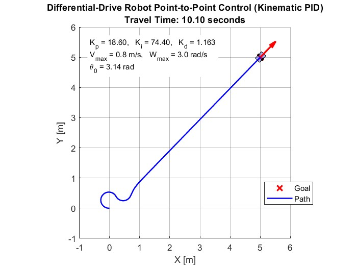 
    </td>
  </tr>

  <tr>
    <td align="center" valign="top">
      <b>Figure 16.</b> Response of PID controller tuned by Ziegler Nichols method
    </td>
    <td align="center" valign="top">
      <b>Figure 17.</b> Robot trajectory of PID controller tuned by Ziegler Nichols method
    </td>
  </tr>
</table>

- Overshoot: 77.3%  
- Settling time: 10.05 s  
- Steady-state error: 0.0432  

The PID controller exhibits the largest overshoot and the slowest settling time among all configurations. Additionally, a non-zero steady-state error appears despite the presence of integral action.

**Observation:** The derivative term does not improve performance in this case and instead contributes to oscillatory behavior when combined with aggressive Ziegler–Nichols tuning.

### General Observation

The Ziegler–Nichols method produces aggressive controller gains, which lead to large overshoot and oscillations in this kinematic system.

- The P controller provides the best overall performance  
- The PI and PID controllers introduce unnecessary oscillations  
- Increasing controller complexity does not guarantee improved performance  

Although Ziegler–Nichols offers a systematic tuning approach, it is not well suited for this type of nonlinear, geometry-driven control problem without further refinement.

---

## ⚙️ MATLAB PID Tuner Method

The MATLAB PID Tuner app provides an automatic approach for tuning PID controllers based on the system dynamics. It computes controller gains to achieve a balance between fast response and robustness.

Unlike manual tuning or Ziegler–Nichols methods, the PID Tuner adjusts the controller parameters by analyzing the system behavior and optimizing performance according to desired design criteria.

### Tuning Procedure

The PID Tuner was applied to the system by:

- Linearizing the control loop around an operating point  
- Selecting the desired controller structure (P, PI, PID)  
- Adjusting the response speed and robustness using the tuner interface  

The tool automatically computes the controller gains based on these settings.

### Obtained Parameters

After applying the PID Tuner for P, PI, and PID configurations, the resulting gains are summarized below:

| Controller | Kp    | Ki    | Kd  |
|------------|-------|-------|-----|
| P          | 27.53 | —     | —   |
| PI         | 17.52 | 61.13 | —   |
| PID        | 13.47 | 33.64 | 0.2 |

### System Response

The tuned controllers were simulated, and the following responses were analyzed:

- Heading error $( \alpha $) over time  
- Robot trajectory from start to goal position  

The corresponding plots are shown below.

### P Controller Response

<table align="center" style="table-layout: fixed;">
  <tr>
    <td align="center" width="50%">
      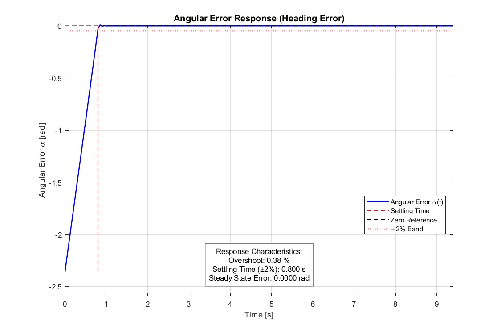 
    </td>
    <td align="center" width="50%">
      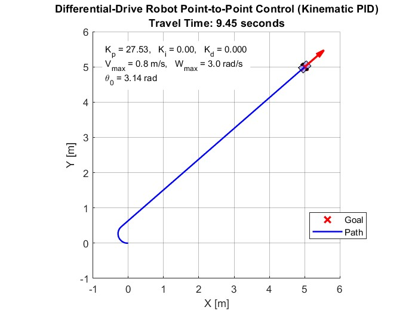 
    </td>
  </tr>

  <tr>
    <td align="center" valign="top">
      <b>Figure 18.</b> Response of P controller tuned by MATLAB PID Tuner
    </td>
    <td align="center" valign="top">
      <b>Figure 19.</b> Robot trajectory of P controller tuned by MATLAB PID Tuner
    </td>
  </tr>
</table>

### PI Controller Response

<table align="center" style="table-layout: fixed;">
  <tr>
    <td align="center" width="50%">
      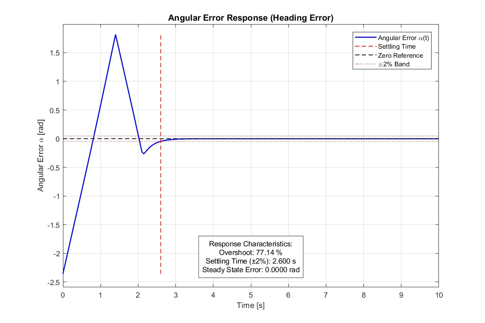 
    </td>
    <td align="center" width="50%">
      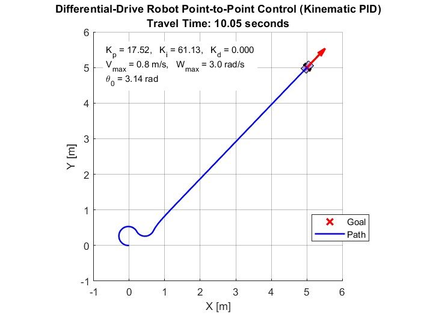 
    </td>
  </tr>

  <tr>
    <td align="center" valign="top">
      <b>Figure 20.</b> Response of PI controller tuned by MATLAB PID Tuner
    </td>
    <td align="center" valign="top">
      <b>Figure 21.</b> Robot trajectory of PI controller tuned by MATLAB PID Tuner
    </td>
  </tr>
</table>

### PID Controller Response

<table align="center" style="table-layout: fixed;">
  <tr>
    <td align="center" width="50%">
      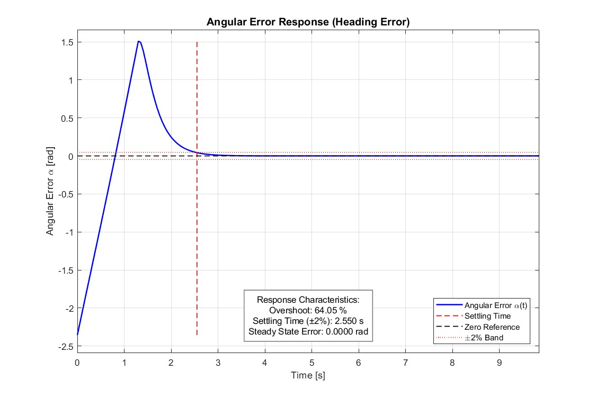 
    </td>
    <td align="center" width="50%">
       
    </td>
  </tr>

  <tr>
    <td align="center" valign="top">
      <b>Figure 22.</b> Response of PID controller tuned by MATLAB PID Tuner
    </td>
    <td align="center" valign="top">
      <b>Figure 23.</b> Robot trajectory of PID controller tuned by MATLAB PID Tuner
    </td>
  </tr>
</table>

## 💬 Discussion

The MATLAB PID Tuner method provides an automated and more controlled approach to selecting controller gains compared to manual tuning and Ziegler–Nichols methods.

Based on the obtained results:

- The P controller achieves fast convergence with very low overshoot (0.38%) and zero steady-state error, similar to the Ziegler–Nichols case  
- The PI controller eliminates steady-state error but introduces large overshoot (77.14%), indicating strong integral action  
- The PID controller improves upon the Ziegler–Nichols PID by reducing settling time (2.55 s vs 10.05 s) and eliminating steady-state error, although overshoot remains relatively high (64.05%)  

Overall, the PID Tuner produces more balanced controller parameters compared to Ziegler–Nichols, particularly for the PID configuration. However, the results confirm that adding integral and derivative actions does not necessarily improve performance for this system.

The ability to adjust the trade-off between response speed and robustness makes the PID Tuner a practical tool, but its effectiveness still depends on the nature of the controlled system.

---

## 🔍 Comparison of Tuning Methods

A comparison between manual tuning, Ziegler–Nichols, and MATLAB PID Tuner reveals key insights into their effectiveness for this system.

- Manual tuning provided the most effective results, allowing direct control over system behavior and leading to fast convergence with minimal oscillations when parameters were carefully selected  
- Ziegler–Nichols tuning produced aggressive parameter values, resulting in large overshoot and oscillatory responses, indicating that this method is not well suited for the given kinematic model without further adjustment  
- PID Tuner offered a more balanced and automated tuning approach, improving stability compared to Ziegler–Nichols and reducing extreme behaviors, although it still introduced noticeable overshoot in some configurations  

Overall, the results show that tuning methods designed for general dynamic systems do not always translate well to simplified kinematic models.

Manual tuning, despite being less systematic, proved to be more effective in achieving stable and efficient robot motion in this case.

This highlights the importance of adapting the tuning approach to the specific characteristics of the system rather than relying solely on standard methods.

---

## 🚧 Failure Case & Velocity Scaling Fix

### ⚠️ Problem: Goal Proximity Instability

  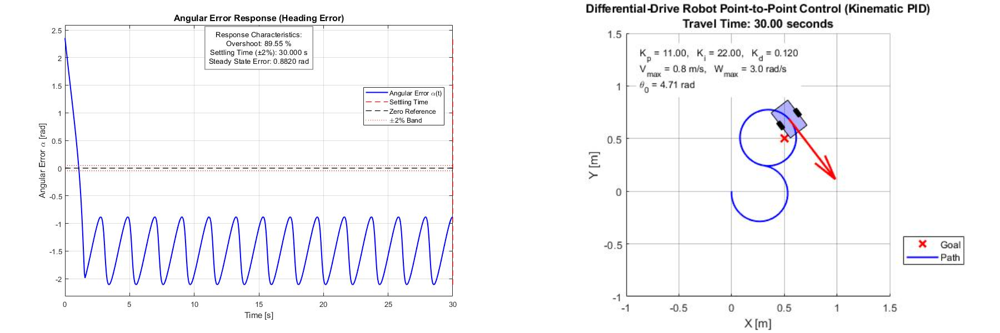 
  <b>Figure 24.</b> Failure case with constant velocity.

When the goal is close to the robot’s starting position, the system exhibits a failure mode:  
- The robot enters a circular motion  
- It fails to converge to the goal  
- This occurs under constant linear velocity (v = 0.8 m/s) 

The robot rotates around the goal without converging, despite correct heading control.

### 🔍 Root Cause Analysis

This behavior arises from the interaction between:  
- Constant forward velocity (v = const)  
- Heading-based control (α)  
- Small distance-to-goal (ρ)  

**Key issue:**  
- When ρ is small, the robot still moves forward aggressively  
- Angular corrections alone are not sufficient to reduce positional error  
- This creates a limit cycle (circular motion near the goal)  

➡️ The controller corrects orientation, but position never settles  

---

### 💡 Proposed Solution: Distance-Based Velocity Scaling

To prevent abrupt stopping and improve smooth deceleration near the goal, the linear velocity is scaled based on the remaining distance:

$$
v = k_p \cdot \rho \quad \text{for } \rho \leq \sqrt{2}
$$

Where:
- $( \rho $): Euclidean distance to the goal  
- $( k_p $): proportional gain

### Parameter Selection

- **Threshold distance ($\rho \leq \sqrt{2}$)**:  
  This value corresponds to the diagonal of a 1×1 grid cell, which makes it a natural boundary for switching into a slowing-down regime when the robot enters a close-to-goal region.

- **Velocity gain ($k_p$)**:

$$
k_p = \frac{V_{max}}{\sqrt{2}} = \frac{0.8}{\sqrt{2}}
$$

This ensures that the velocity remains bounded by the robot’s maximum limit:

$$
v \leq V_{max} = 0.8 \text{ m/s}
$$

### Effect

- Smooth reduction of velocity as the robot approaches the goal  
- Reduced overshoot due to gradual braking  
- Stable behavior in the final approach phase

### 📉 Behavior After Fix

  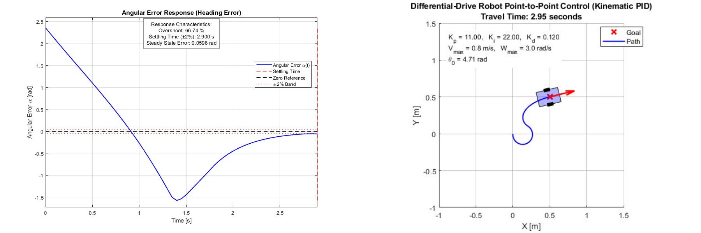 
  <b>Figure 25.</b> Trajectory after applying velocity scaling.

The robot smoothly decelerates as it approaches the goal and successfully converges without oscillations.

### 📊 Effect on System Behavior

#### Before (Constant Velocity)
- Persistent circular motion near goal  
- No positional convergence  
- Control effort wasted in rotation  

#### After (Scaled Velocity)
- Velocity decreases with distance  
- Stable convergence to goal  
- No oscillatory behavior  

---

### 🧠 Key Insight

- Heading control alone is not sufficient for convergence when linear velocity is constant.  
- Position control requires coupling between velocity and distance  
- Reducing velocity near the goal prevents overshoot and limit cycles  

### 📌 Final Takeaway

- The failure was not due to PID tuning, but control structure  
- A simple modification to velocity resolves the issue:  
  - No need for complex controllers  
  - Works reliably across all configurations  

### 🧾 Summary of Contributions

- Identified a limit-cycle failure mode in kinematic control  
- Diagnosed the issue as velocity–distance decoupling  
- Proposed and validated a distance-based velocity scaling law  
- Demonstrated improved convergence in simulation

---

## 🏁 Conclusion

This project investigated heading control of a differential-drive mobile robot using P, PI, PD, and PID controllers in a MATLAB simulation environment. The objective was to evaluate trajectory tracking performance and goal-reaching behavior under different control and tuning strategies.

Three tuning methods were compared: manual tuning, Ziegler–Nichols, and MATLAB PID Tuner. Results showed that Ziegler–Nichols generally produces overly aggressive gains, leading to oscillatory behavior and large overshoot, while PID Tuner provides more balanced performance but still reflects the limitations of the underlying kinematic system. Manual tuning consistently achieved the best overall performance, particularly with a well-chosen proportional gain.

A key observation is that increasing controller complexity does not guarantee improved performance for kinematic mobile robots. Integral action introduces windup and overshoot, while derivative action tends to amplify discrete changes in heading error, resulting in oscillations rather than true damping.

A critical failure case was identified when the robot approached the goal under constant linear velocity, causing persistent circular motion and preventing convergence. This issue was not related to PID tuning but to the control structure itself. It was resolved by introducing a distance-based velocity scaling strategy, which smoothly reduces the robot’s speed near the target and restores stable convergence.

Overall, the study highlights that effective mobile robot control depends more on matching the control structure to the system kinematics than on using complex controllers. For this system, simple proportional control combined with appropriate velocity scaling proved more robust and effective than full PID-based designs.
