# Differential-Drive-Mobile-Robot-Control-PID-Study

Differential-drive mobile robot control using P, PI, and PID controllers. MATLAB simulation of robot motion from start to goal with trajectory visualization and performance comparison.

---

## 📌 Project Overview

This project investigates the control of a differential-drive mobile robot using kinematic modeling and feedback control techniques.

The robot is required to move from an initial position to a desired goal position, while adjusting its heading appropriately.

The main goal is to design, implement, and compare different controllers—Proportional (P), Proportional-Integral (PI), Proportional-Derivative (PD) and Proportional-Integral-Derivative (PID)—for heading control.

Different tuning methods (manual tuning, Ziegler–Nichols, and MATLAB PID Tuner) are applied and compared to obtain the best controller performance.

The controllers are evaluated based on trajectory smoothness and the robot’s ability to reach the desired goal position.

The system is developed and simulated in MATLAB, with visualizations of robot motion and path tracking.

---

## 🎯 Objectives

- Use a kinematic model of a differential-drive robot to compute control inputs  
- Compute heading error from the position (x, y) to a desired goal  
- Design and implement heading controllers (P, PI, PD, PID) to generate angular velocity (ω)
- Apply and compare different tuning methods (Manual, Ziegler–Nichols, and MATLAB PID Tuner)  
- Compare controller performance based on trajectory smoothness and goal reaching  
- Visualize robot motion and trajectory behavior  

---

## ✨ Features

- Simulation of a differential-drive mobile robot in MATLAB  
- Implementation of P, PI, PD and PID controllers
- Application and comparison of different tuning methods (manual, Ziegler–Nichols, MATLAB PID Tuner)  
- Trajectory generation from start to goal position  
- Visualization of robot motion and path  
- Comparison of controller performance  

---

## ⚙️ Mobile Robot Model

A differential-drive mobile robot is used in this project. It consists of two independently driven wheels separated by a fixed distance, allowing the robot to move by controlling the wheel velocities.

The robot motion is described using three state variables: position (x, y) and orientation (θ), and two control inputs: linear velocity (v) and angular velocity (ω). This makes the system multivariable.

The kinematic model of the robot is nonlinear, since the position states depend on the orientation through trigonometric relationships:

$$
\dot{x} = v  \cos(\theta)
$$

$$
\dot{y} = v  \sin(\theta)
$$

$$
\dot{\theta} = \omega
$$

Because of this nonlinearity, directly controlling (x, y, θ) is not straightforward using simple feedback control.

To simplify the problem, the linear velocity is kept constant, and the control effort is focused on regulating the robot heading. The position then evolves naturally based on the heading direction.

Additionally, the linear velocity is reduced when the robot approaches close distance to the goal to avoid oscillations and improve convergence.

---

## 🎮 Controller Design

### Error Definition

To guide the robot toward the goal position (x_goal, y_goal), the following errors are defined:

$$
\Delta x = x_{goal} - x
$$

$$
\Delta y = y_{goal} - y
$$

From these, two important quantities are computed:

$$
\rho = \sqrt{\Delta x^2 + \Delta y^2}
$$

$$
\alpha = \arctan2(\Delta y, \Delta x) - \theta
$$

Here, ρ represents how far the robot is from the goal, while α represents the angular deviation from the desired direction.

---

### Control Law

The control objective is to reduce the heading error α to zero. This is achieved using a PID controller:

$$
u(t) = K_p e(t) + K_i \int e(\tau)\, d\tau + K_d \frac{de}{dt}
$$

where the error $( e(t) = \alpha $).

The controller output defines the angular velocity:

$$
\omega = PID(\alpha)
$$

---

### Actuator Constraints and Wheel Velocity Computation

The computed angular velocity is limited to ensure that the control input remains within the achievable bounds of the actuators:

$$
\omega \in [-\omega_{max}, \omega_{max}]
$$

After applying saturation, the control inputs must be translated into actuator commands. Since the robot is driven by two wheels, the linear and angular velocities (v, ω) are converted into individual wheel angular velocities.

Using the inverse kinematics of the differential-drive robot:

$$
\omega_r = \frac{2v + \omega b}{2r}
$$

$$
\omega_l = \frac{2v - \omega b}{2r}
$$

where:

- r is the wheel radius  
- b is the distance between the two wheels  

These equations map the desired motion of the robot into motor commands for the right and left wheels.

The resulting wheel velocities are then applied to the robot, generating motion toward the goal position.

---

## 🧠 Controller Motivation and Parameter Effects

The heading error α plays a key role in the robot’s trajectory behavior:

- If α → 0, the robot aligns with the goal direction  
- If α remains large, the robot may overshoot or deviate from the desired path  

This motivates the use of feedback controllers to regulate the heading and ensure convergence toward the goal.

Different controller structures offer different performance characteristics:

- **P controller:** simple and responsive, but may result in steady-state error  
- **PI controller:** eliminates steady-state error, but may introduce slower response and overshoot  
- **PD controller:** improves responsiveness and reduces oscillations, but is sensitive to noise  
- **PID controller:** combines the advantages of all three for balanced performance  

The influence of PID parameters on system behavior is well established in control theory. In general:

- $( K_p $) increases responsiveness and reduces rise time, but may lead to overshoot  
- $( K_i $) eliminates steady-state error, but can slow the response and increase overshoot  
- $( K_d $) improves damping, reduces oscillations, and enhances stability  

These relationships provide practical guidelines for tuning controller parameters.

A comparison table is typically used to relate these parameters to performance metrics such as rise time, overshoot, settling time, and steady-state error.
| Parameter Increase| Rise Time     | Overshoot     | Settling Time  | Steady-State Error |
|-------------------|---------------|---------------|----------------|--------------------|
| Kp                | Decrease      | Increase      | Small change   | Decrease           |
| Ki                | Small change  | Increase      | Increase       | Greatly reduced    |
| Kd                | Small change  | Decrease      | Small change   | Small change       |

---

## 🧩 Simulink Implementation

The complete control system is implemented in Simulink, integrating the kinematic model, error computation, and feedback controller into a closed-loop system.

The diagram below shows the overall structure of the control system, including:
- computation of the heading error  
- the PID controller  
- conversion to wheel velocities  
  

   
  <b>Figure 1.</b> Control system block diagram

<table align="center" style="table-layout: fixed;">
  <tr>
    <td align="center" width="50%">
       
    </td>
    <td align="center" width="50%">
       
    </td>
  </tr>

  <tr>
    <td align="center" valign="top">
      <b>Figure 2.</b> Distance calculator subsystem
    </td>
    <td align="center" valign="top">
      <b>Figure 3.</b> Kinematic model subsystem
    </td>
  </tr>
</table>

This implementation reflects the full control pipeline, from position error computation to actuator commands, enabling simulation of the robot motion toward the desired goal.

---

## 🚗 Velocity Constraints and Analysis

### 📐 Theoretical Maximum Velocities

The maximum rotational speed of the motors can be converted from RPM to angular velocity (rad/s), giving the maximum wheel speeds.

Using the robot kinematics, the theoretical limits of motion can be derived:

- Maximum linear velocity occurs when both wheels rotate at maximum speed in the same direction  
- Maximum angular velocity occurs when the wheels rotate at maximum speed in opposite directions  

These values represent ideal upper bounds under perfect conditions.

### ⚙️ Practical Velocity Limits

The theoretical maximum velocities are derived under ideal assumptions and represent upper bounds of the robot’s capabilities. However, in practice, these values cannot be fully achieved due to factors such as system dynamics, actuator limitations, and external loads, which effectively reduce the attainable speeds.

For this project, the robot parameters are:

- Wheel radius: $( r = 0.05 \text{m} $)  
- Wheel separation: $( b = 0.2 \text{m} $)  

Based on these considerations, conservative and practical limits were selected:

$$
v_{\text{max}} = 0.8 \, \text{m/s}
$$

$$
\omega_{\text{max}} = 3 \, \text{rad/s}
$$

These limits ensure reliable operation by keeping the system within achievable performance bounds. They also help maintain smooth motion and allow the feedback controller to operate effectively without demanding unrealistically high actuator speeds.

---

## 📊 Effect of Velocity Limits

The effect of varying $( v_{\text{max}} $) and $( \omega_{\text{max}} $) on robot performance was analyzed through simulation.

Different values were tested, and the resulting trajectories were compared to evaluate:

- Smoothness of motion  
- Ability to reach the goal  
- Presence of oscillations  

The results are presented in the next section.

### 🔄 Effects of Varying $( v_{\text{max}} $) and $( \omega_{\text{max}} $)

   
  <b>Figure 4.</b> Trajectory comparison under different velocity constraints

The robot's behavior changes significantly when the maximum linear velocity $( v_{\text{max}} $) or maximum angular velocity $( \omega_{\text{max}} $) is adjusted, while keeping the PID gains fixed.

#### Effect of High $( v_{\text{max}} $)

Increasing $( v_{\text{max}} $) reduces the time needed to reach the goal because the robot moves faster along its path.

For example, increasing $( v_{\text{max}} $) from **0.80 m/s** to **1.50 m/s** (with $( \omega_{\text{max}} = 3.00 \, \text{rad/s} $)) reduced completion time from **8.90 s** to **4.75 s** as shown in Figure 4:

However, when the initial heading error is large, a higher $( v_{\text{max}} $) leads to wider turning arcs:
- The robot travels farther forward while correcting its heading  
- This causes outward drift during the initial turn  
- Results in larger loops before alignment with the goal  

**Trade-off:** faster completion vs. less efficient trajectory.

#### Effect of High $( \omega_{\text{max}} $)

Increasing $( \omega_{\text{max}} $) improves the robot's ability to change direction quickly.

- Faster alignment with the goal  
- More direct trajectory  
- Reduced overshoot and wasted motion  

In contrast, if $( \omega_{\text{max}} $) is too low relative to $( v_{\text{max}} $):

- The robot struggles to correct its heading  
- Wide arcs or sustained oscillations appear  

For example, reducing $( \omega_{\text{max}} $) from **3.00 rad/s** to **1.00 rad/s** (at $( v_{\text{max}} = 0.80 \, \text{m/s} $)) as shown in Figure 4:

- Introduced large oscillatory loops  
- Increased completion time from **9.85 s** to **14.30 s**  

---

## 📊 Controller Performance Evaluation

This section summarizes the performance of different manually-tuned controller configurations (P, PI, PD, PID) for heading control (α) in a differential drive robot under a kinematic model.

### 📈 Summary Table

| Config | Controller | Parameters | Time to Goal (s) | Overshoot (%) | Settling Time (s) | SSE (rad) | Path Behavior | Verdict |
|--------|-----------|------------|------------------|----------------|-------------------|------------|----------------|----------|
| 1 | P | Kp=0.5 | >30 (fail) | — | — | 1.5599 | Spiral | Unstable |
| 2 | P | Kp=1 | 10.05 | 0 | 4.4 | 0.0216 | Wide arc | Slow, residual error |
| 3 | P | Kp=11 | 9.45 | 0 | 0.85 | ~0 | Near-straight | Best overall |
| 4 | PI | Kp=11, Ki=10 | 9.65 | 33.66 | 4.1 | ~0 | S-curve | Overshoot introduced |
| 5 | PI | Kp=11, Ki=100 | 10.95 | 90.51 | 4.45 | ~0 | Loop | Windup dominant |
| 6 | PD | Kp=11, Kd=1 | 9.50 | 2.84 | 9.45 | 0.1798 | Near-straight | Chatter, high SSE |
| 7 | PID | Kp=11, Ki=100, Kd=1 | 10.70 | 90.51 | 10.65 | 0.0117 | Loop | Worse than PI |

---

### 📍 Trajectory Comparison

<table align="center" style="table-layout: fixed;">
  <tr>
    <td align="center" width="50%">
      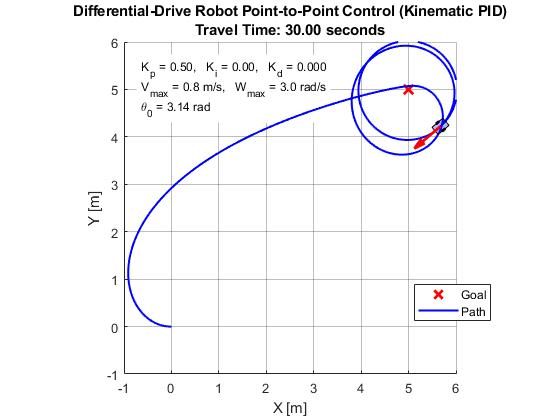 
      Config 1
    </td>
    <td align="center" width="50%">
      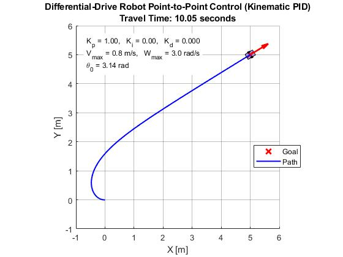 
      Config 2
    </td>
  </tr>

  <tr>
    <td align="center">
      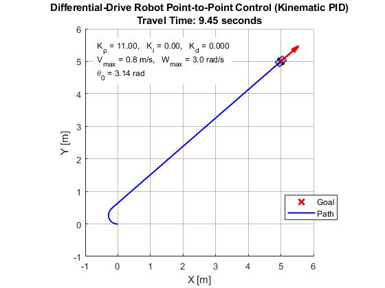 
      Config 3
    </td>
    <td align="center">
      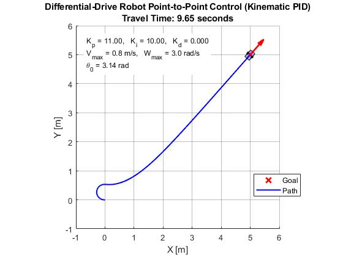 
      Config 4
    </td>
  </tr>

  <tr>
    <td align="center">
      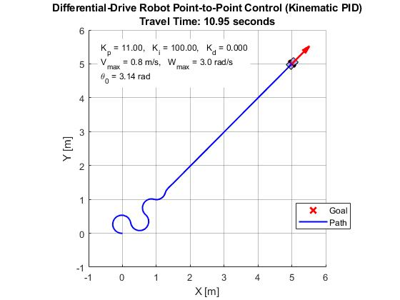 
      Config 5
    </td>
    <td align="center">
      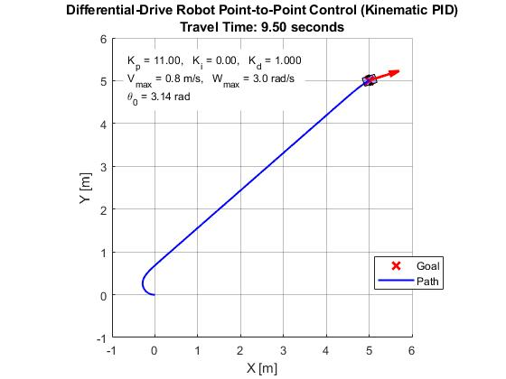 
      Config 6
    </td>
  </tr>

  <tr>
    <td colspan="2" align="center">
       
      Config 7
    </td>
    <td></td>
  </tr>
</table>

  <b>Figure 5.</b> Robot trajectories for all controller configurations.

- Config 1 shows complete instability (spiral motion).  
- Configs 3 and 6 produce near-straight paths.  
- Configs 5 and 7 exhibit loops due to integral windup.

---

### 📉 Heading Error (α) Response
<table align="center" style="table-layout: fixed;">
  <tr>
    <td align="center" width="50%">
      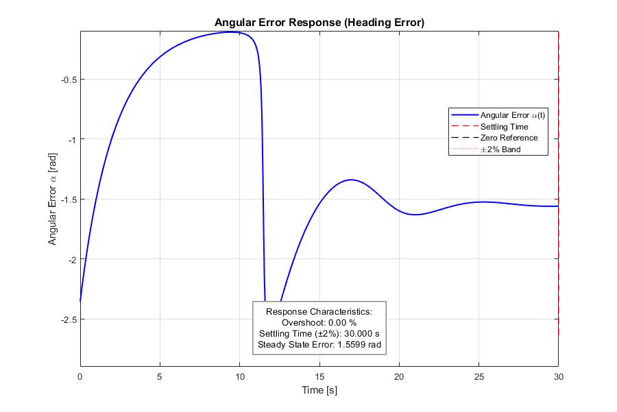 
      Config 1
    </td>
    <td align="center" width="50%">
      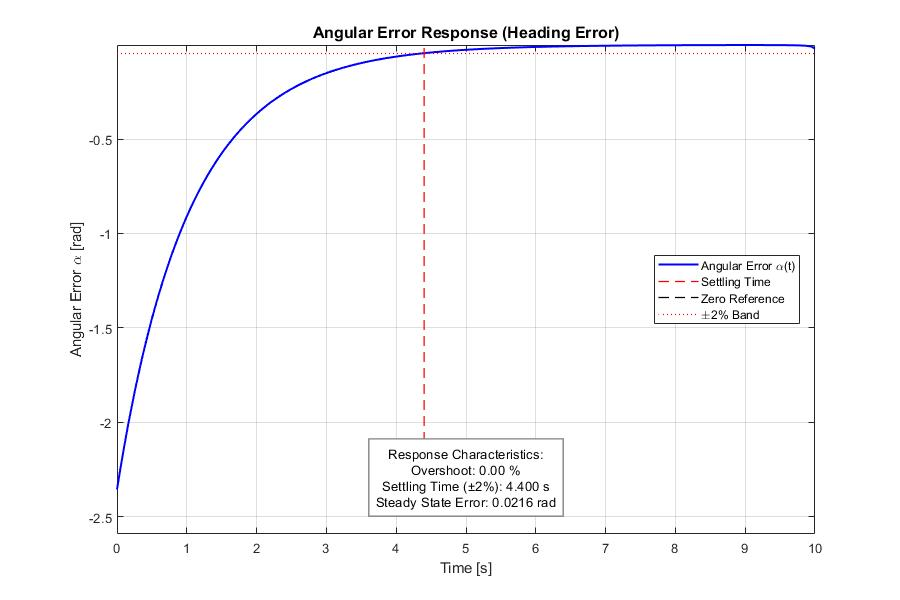 
      Config 2
    </td>
  </tr>

  <tr>
    <td align="center">
      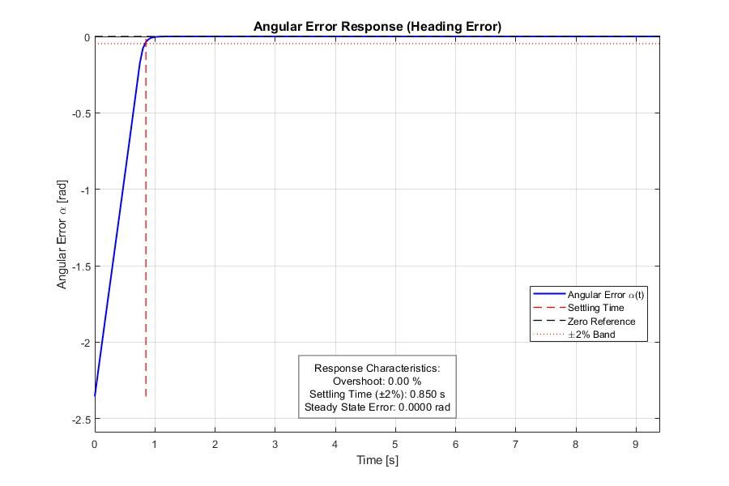 
      Config 3
    </td>
    <td align="center">
      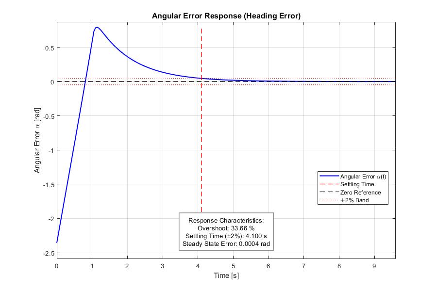 
      Config 4
    </td>
  </tr>

  <tr>
    <td align="center">
      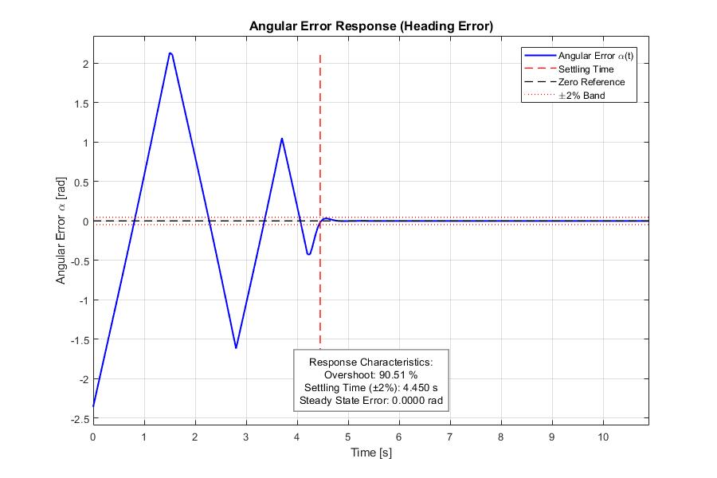 
      Config 5
    </td>
    <td align="center">
      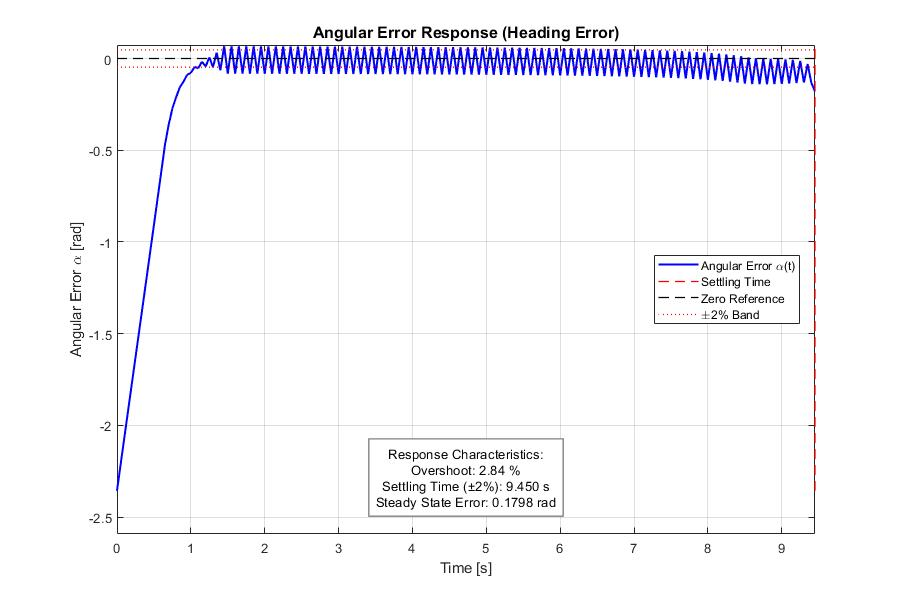 
      Config 6
    </td>
  </tr>

  <tr>
    <td colspan="2" align="center">
      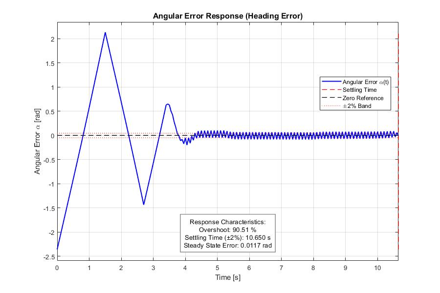 
      Config 7
    </td>
    <td></td>
  </tr>
</table>

  <b>Figure 6.</b> Heading error (α) over time for all configurations.

- P-only (Config 3) achieves the fastest clean convergence.  
- PI controllers eliminate steady-state error but introduce overshoot.  
- PD and PID configurations show persistent oscillations (chatter).

---

### 🔍 Detailed Observations

#### P Controllers
- Increasing Kp improves convergence speed and path efficiency.  
- Low gain (Kp=0.5) fails to correct heading.  
- High gain (Kp=11) is sufficient to drive error ≈ 0 without oscillations.  

#### PI Controllers
- Integral term eliminates steady-state error.  
- Higher Ki leads to integral windup, causing:  
  - Large overshoot  
  - Path distortion (loops)  
- Moderate Ki (Config 4) provides a trade-off but still degrades transient response.  

#### PD Controller
- Expected damping effect is not observed.  
- Derivative term introduces persistent small oscillations in α.  
- Results in the largest steady-state error among stable configurations.  

#### PID Controller
- Combines drawbacks of PI and PD:  
  - Windup from high Ki  
  - Oscillations from Kd  
- Does not outperform simpler configurations.  

---

### 🧠 Key Takeaways

- High proportional gain alone (Kp=11) provides the best performance in this kinematic system.  
- Integral control removes steady-state error but harms trajectory quality.  
- Derivative control amplifies discrete geometric updates, leading to oscillations rather than damping.  
- Classical PID tuning intuition does not directly apply to kinematic (non-dynamic) systems.  

### 📎 Notes

- All experiments were conducted under identical simulation conditions.  
- Constant forward velocity was maintained across all configurations.  
- Metrics computed from heading error (α) and trajectory tracking performance.  

---
